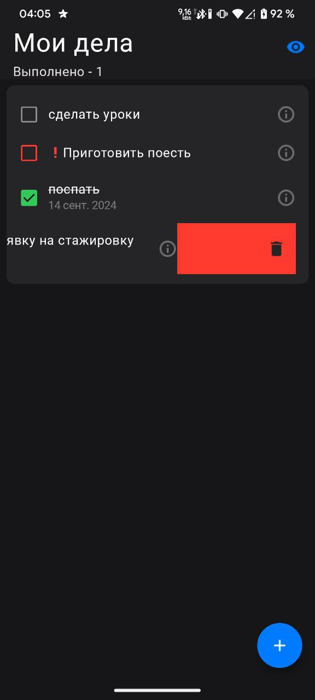
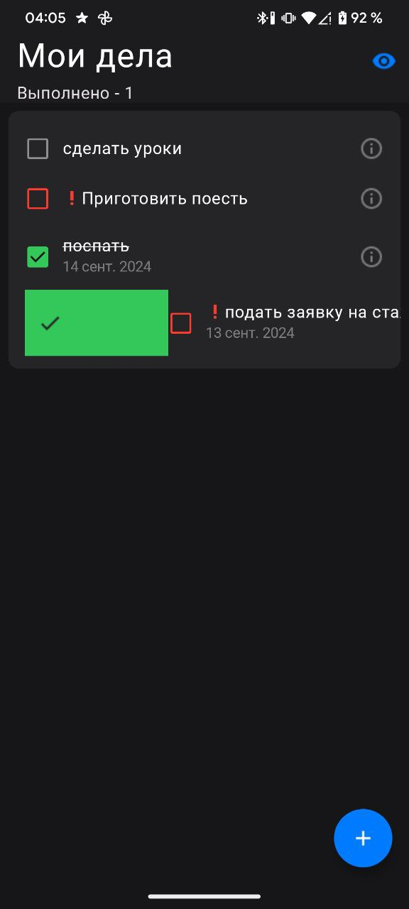
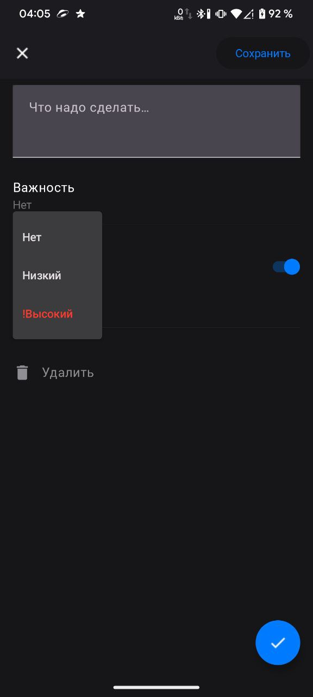
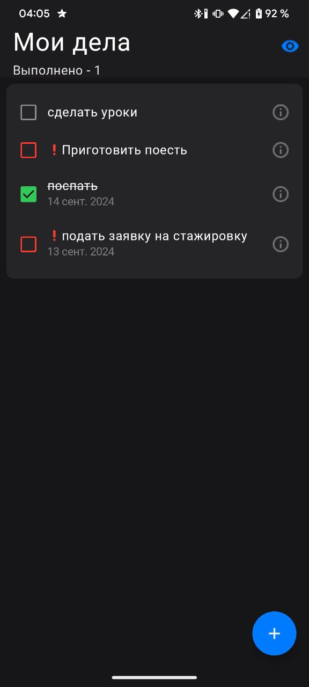
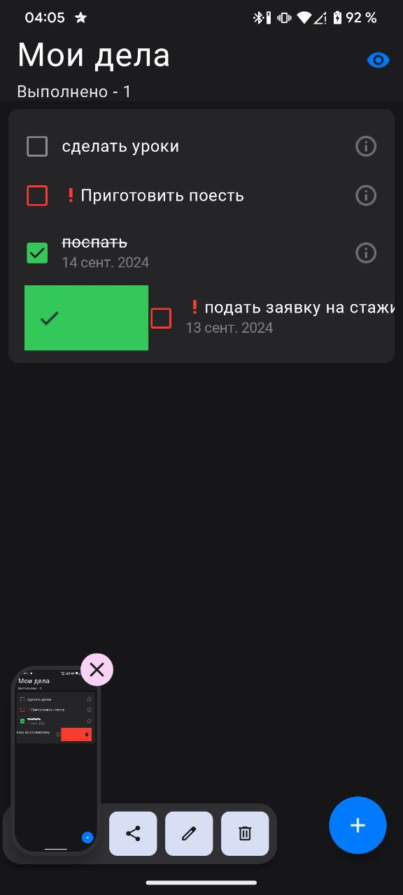
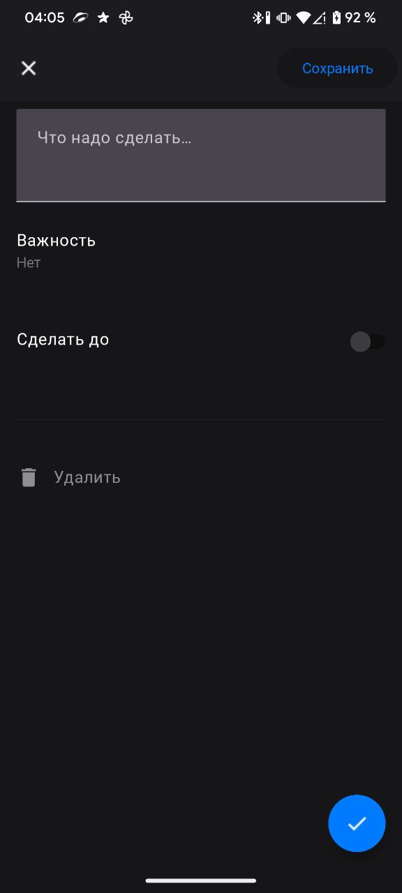
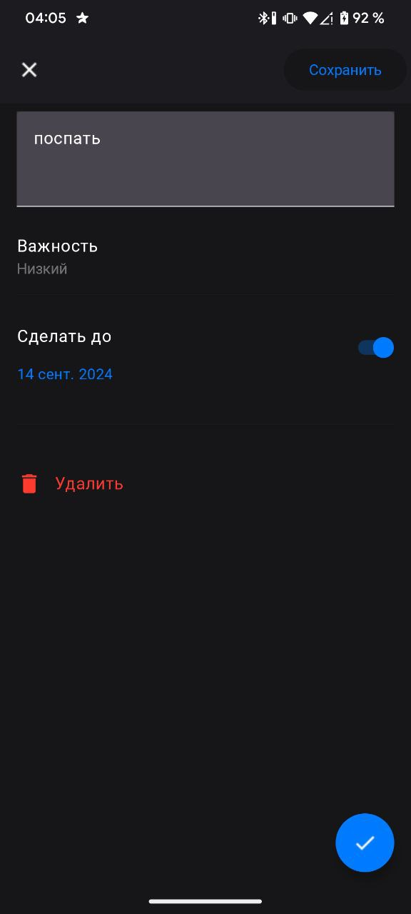
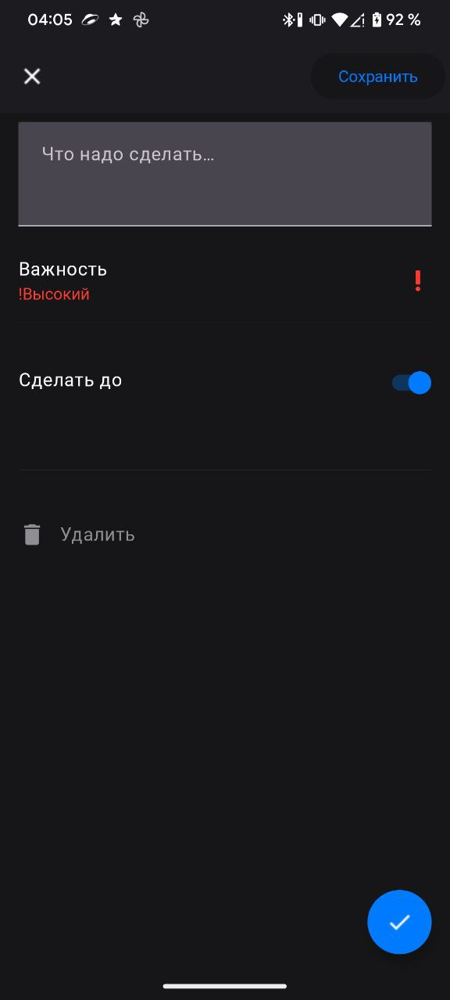
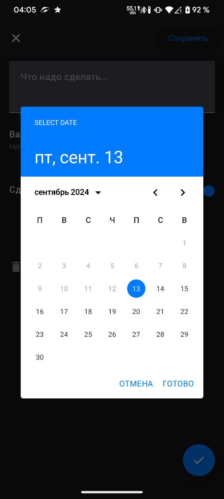
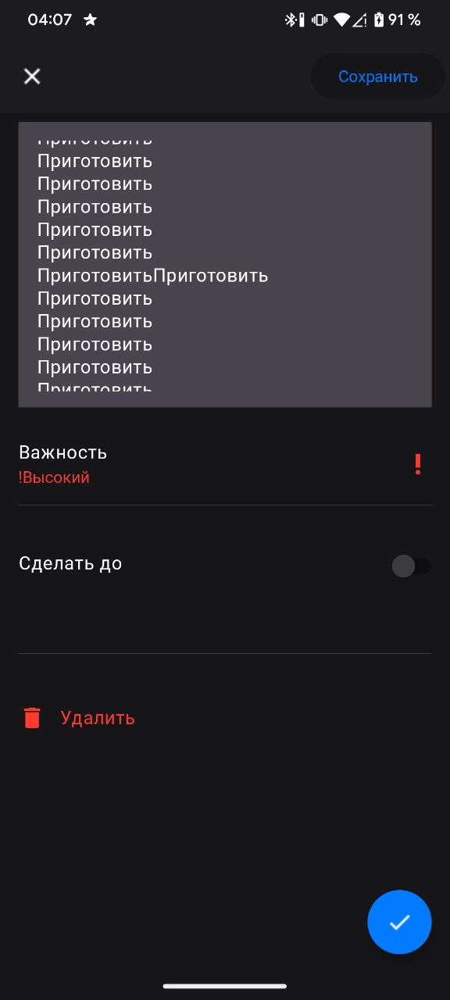

# Список дел

Приложение для списка дел, домашнее задание Школы мобильной разработки от Яндекса ([ТЗ](https://disk.yandex.ru/edit/d/2v2zfJ7WLJFBZWvkjKC5-yPegnqahzm72s0qoIz-cKg6d1VqRm53ZS1fUQ), [Дизайн](https://www.figma.com/design/gugusDLUlvMczCSDXSzpTa/%E2%9C%85-%D0%A1%D0%B4%D0%B5%D0%BB%D0%B0%D1%82%D1%8C---design?node-id=51-23281&node-type=frame&t=qZuvZ5uBk7kGGHmu-0)).  
Приложение разработано на языке Kotlin с использованием Jetpack Compose для пользовательского интерфейса и Room для работы с базой данных.

## **Функциональные требования**

### Экран списка дел

На данном экране отображаются все "задачи" с визульной информацией о дедлайне(при наличии), приоритете задачи(если его обозначили), а также с чекбоксом, отображающий выполнена ли задача. Реализовано удаление/выполнение задачи по свайпу карточки. В TopBar отображается кол-во выполненных задач.

### Экран создания/редактирования задачи

На экране можно задать/изменить содержание задачи, изменить приоритет(Нет, Низкий, !Высокий) задачи, дедлайн. Если экран открыт в режиме редактирования, то можно удалить заметку по нажатию соответствующей кнопки. В режиме создания кнопка не активна.

### Скриншоты























## Стек
 - Язык: kotlin
 - Работа с базой данных: Room
 - Многопоточность: Kotlin Coroutine
 - View: Jetpack Compose
 - Навигация: Jetpack Navigation
 - Архитектура: Clean Architecture
 - Паттерн проектирования: MVVM

## **Инструкция по запуску**

1. Клонируйте репозиторий:
   ```bash
   git clone <URL-репозитория>
2. Откройте проект в Android Studio.
3. Соберите и запустите приложение на эмуляторе или устройстве Android.
